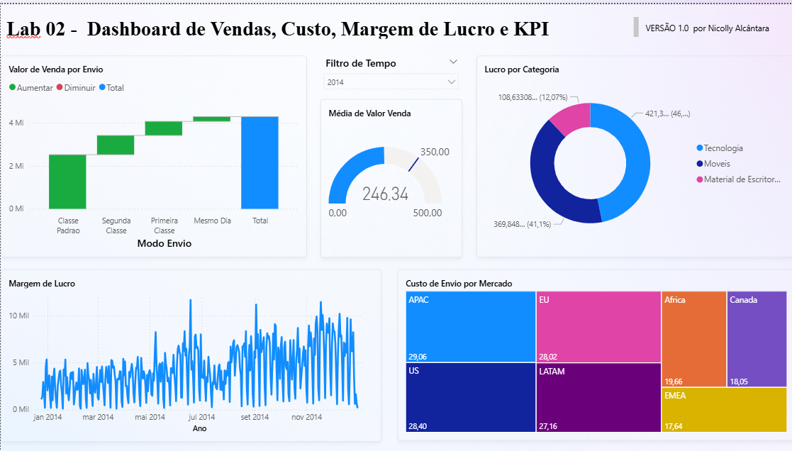

#  Análise de Vendas, Custos e Margem de Lucro com Power BI

##  Sobre o projeto

Dashboard desenvolvido no Power BI com foco na análise de vendas, custos, margem de lucro e indicadores de desempenho.

O projeto permite analisar os resultados considerando diferentes categorias, mercados, modos de envio e períodos, facilitando a interpretação dos dados e o acompanhamento dos principais indicadores.

##  Ferramenta utilizada

- Power BI Desktop

##  Indicadores analisados

O dashboard apresenta indicadores relacionados a:

- Vendas;
- Custos de envio;
- Lucro;
- Margem de lucro;
- Indicadores de desempenho (KPI).

##  Análises realizadas

Entre as análises desenvolvidas estão:

- Valor de venda por modo de envio;
- Custo de envio por mercado;
- Lucro por categoria;
- Análise da margem de lucro ao longo do tempo;
- Acompanhamento de indicadores de desempenho;
- Comparação dos resultados ao longo dos períodos analisados.

##  Interatividade

O dashboard permite explorar os dados por meio de filtros e recursos de interação, possibilitando uma análise mais detalhada dos indicadores apresentados.

##  Dashboard

## 📁 Arquivo do projeto

O arquivo `.pbix` utilizado na construção do dashboard está disponível neste repositório:

**[projeto-vendas-kpi.pbix](./projeto-vendas-kpi.pbix)**

## 💡 Objetivo

Demonstrar a aplicação do Power BI na organização, análise e visualização de dados, transformando informações de vendas e custos em indicadores para acompanhamento do desempenho.

## 👩‍💻 Autora

**Nicolly Alcântara**

Tecnóloga em Análise e Desenvolvimento de Sistemas | Power BI | Excel | SQL | Análise de Dados
